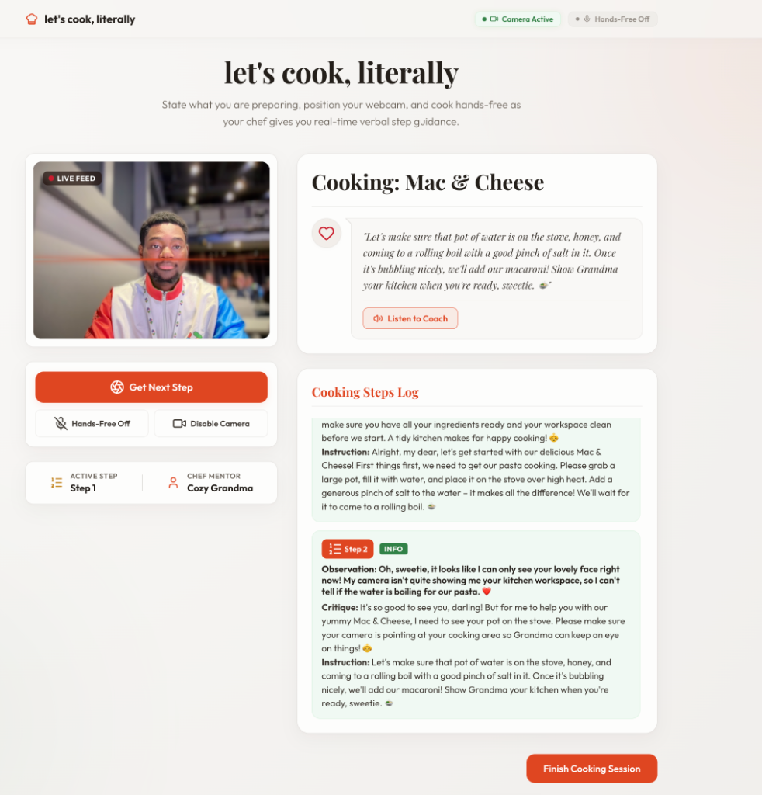

# let's cook, literally 🍳



A live **AI Cook Mentor** that watches you cook in real time via your webcam, guides you through a recipe step-by-step verbally, and analyzes your kitchen workspace frame-by-frame.

Live URL: [https://lets-cook-literally-587945003408.us-central1.run.app](https://lets-cook-literally-587945003408.us-central1.run.app)


---

## What it does (in plain English)

**let's cook, literally** is a hands-free, voice-activated cooking coach. Instead of reading off static screens with messy fingers, you position your webcam, state what you are preparing, and start cooking. The app uses the **Web Speech API** to listen for commands and captures live frames from your webcam. 

The system analyzes your kitchen workspace dynamically to deliver:
1. **Real-time Observations**: Objective descriptions of what the coach observes in the pan/workspace.
2. **Actionable Critiques**: Technical advice or safety warnings delivered in your chosen coach's voice.
3. **Step-by-Step Audio Guidance**: Verbal recipe instructions read aloud via Text-to-Speech (TTS).
4. **Interactive Timeline Log**: A scrollable history of completed steps and critiques, which can be clicked to replay the audio guidance.

### The Culinary Mentors 🧑‍🍳
* **👵 Cozy Grandma**: Warm, doting, comforting culinary support.
* **👨‍🍳 Michelin Chef**: Fine-dining techniques, reductions, elegant plating advice.
* **💰 Scrappy Saver**: Zero-waste efficiency, cents saved, and clever leftovers rescue.
* **☣️ Wasteland Survivor**: High-energy, post-apocalyptic shelter survival instructions.

---

## 💡 The Reflection
### What surprised us?
> "I assumed I'd have to coach Gemini into being empathetic. Turns out it already was — and the instruction I deleted was the one telling it to be kind."

---

## Technical Stack & Architecture

- **Backend**: FastAPI (Python) serving the static frontend and running `/api/coach` image analysis.
- **AI Engine**: Gemini 2.5 Flash (`gemini-2.5-flash`) via the new `google-genai` SDK. Raw JPEG bytes are sent directly to the model using `types.Part.from_bytes` for sub-second structured JSON responses.
- **Frontend**: Glassmorphic Single Page App built with Vanilla HTML/JS and custom CSS (with glowing webcam viewports and scanning laser overlays).
- **Voice Commands**: Browser-native `webkitSpeechRecognition` for hands-free mode ("next", "chef", "check", "step").
- **Voice Synthesis**: Browser-native `window.speechSynthesis` tuned for each mentor's personality.

---

## How to Run Locally

### 1. Sync Dependencies
Inside the `backend/` folder, sync virtual environment dependencies using `uv`:
```bash
cd backend
uv sync
```

### 2. Configuration
Create a `.env` file inside the `backend/` directory:
```env
GEMINI_API_KEY=your_gemini_api_key_here
```

### 3. Run the App
Start the local FastAPI development server:
```bash
uv run uvicorn main:app --reload
```
Open **`http://localhost:8000`** in your browser.

### 4. Run Tests
Ensure the mocked test suite compiles and runs:
```bash
uv run pytest -v
```

---

## Live Deployment to Google Cloud Run

The application is deployed live using the **Google Cloud CLI (`gcloud`)** directly to Google Cloud Run:
```bash
gcloud run deploy lets-cook-literally \
  --source . \
  --project gen-lang-client-0154753147 \
  --region us-central1 \
  --allow-unauthenticated \
  --set-env-vars GEMINI_API_KEY=your_gemini_api_key
```

---

## Design Documents
- [Product Specifications](file:///Users/thabhelo/code/codingjam-fridge-chef/product.md)
- [UI/UX Specifications](file:///Users/thabhelo/code/codingjam-fridge-chef/ui.md)
- [Engineering Design Spec](file:///Users/thabhelo/code/codingjam-fridge-chef/engineering.md)
