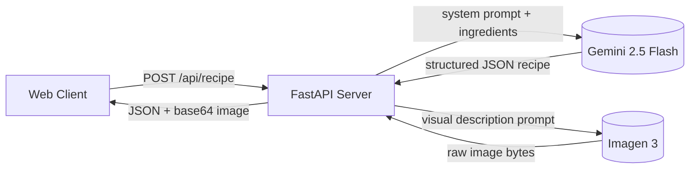

# Fridge Chef — Engineering Design Doc

**Author:** Staff Engineer Antigravity
**Status:** Draft v0.1
**Last updated:** 2026-05-21
**Reviewers:** TBD

---

## 1. Summary

We are building a web application that takes a list of ingredients and a culinary voice, calling Gemini for structured recipe JSON, and then calling Imagen 3 for a base64 encoded photo of the dish. The application is served as a single static webpage from a FastAPI backend. The single most interesting choice is running text and image generation sequentially on the backend with a robust try-except error handling fallback for the image model, ensuring the user always gets their recipe even if image generation fails or times out.

## 2. Assumptions

- **Target scale:** <10k DAU in v1.
- **Latency budget:** p95 < 15s for the core recipe + image generation (Imagen calls are relatively high latency).
- **Platform:** Modern desktop and mobile web browsers.
- **Cost ceiling:** ~$0.04 per recipe generation.
- **Out of scope:** Server-side databases, persistent recipe storage, image hosting on CDNs, and user sessions.

## 3. Goals & non-goals

**Goals (v1):**
- Expose a single FastAPI POST endpoint `/api/recipe` that returns a structured recipe and a base64 image.
- Gracefully fallback to returning the text recipe without an image if the image model times out, errors, or gets flagged by safety filters.
- Serve the frontend static directory securely from FastAPI.
- Run within a virtualenv managed by `uv`.

**Non-goals (v1):**
- User account management or auth token verification.
- Relational database schema migrations (there is no DB, all data is in-memory/transit).
- Image hosting on CDNs/buckets (images are base64 strings returned directly in the JSON response).

## 4. Architecture



**What's here:**
- **Client (Frontend):** A Single Page Application served static from FastAPI.
- **FastAPI Server:** Handles routing, input validation, calls Google GenAI SDK, and base64 encodes the image bytes.
- **Google GenAI SDK:** Standard python client that accesses Gemini (`gemini-2.5-flash`) and Imagen (`imagen-3.0-generate-002`).

**What's deliberately NOT here:**
- **No Database:** No state is persisted on the server. All data exists in transit.
- **No CDN/Storage Bucket:** Generated images are sent directly to the client as base64, eliminating the need for S3/GCS buckets.
- **No Celery/Redis Queue:** The sequential calls happen inside the HTTP request. We choose the simple synchronous architecture over task queues because of the <10k DAU target scale.

## 5. Key components

### Backend API (`backend/main.py`)
- **Responsibility:** Serves the frontend static files and handles `/api/recipe` request dispatching.
- **Tech choice:** FastAPI & Uvicorn.
- **Why this choice:** FastAPI provides automatic schema validation, is extremely lightweight, and handles async requests efficiently.
- **Interface:** Exposes `POST /api/recipe` and `GET /api/health`.

### AI Integrator (`backend/prompts.py` & `backend/main.py`)
- **Responsibility:** Manages prompts and configures the `google-genai` client.
- **Tech choice:** `google-genai` SDK.
- **Why this choice:** The official, unified SDK for accessing Google's generative models.

## 6. Data model

The system is stateless. The data model represents the Pydantic schemas used for request/response serialization.

```python
from pydantic import BaseModel, Field

class RecipeRequest(BaseModel):
    ingredients: str = Field(..., min_length=3, max_length=1000)
    voice: str = "grandma"

class IngredientsSchema(BaseModel):
    rescued: list[str]
    pantry: list[str]

class RecipeResponse(BaseModel):
    title: str
    time: str
    difficulty: str
    commentary: str
    ingredients: IngredientsSchema
    steps: list[str]
    visualDescription: str
    image: str | None = None
```

## 7. API surface

### `POST /api/recipe`
- **Input:** `RecipeRequest` schema.
- **Output:** `RecipeResponse` schema.
- **Errors:** 
  - `400 Bad Request` if input is less than 3 characters.
  - `500 Internal Server Error` if Gemini fails or output is unparsable.
- **Latency budget:** p95 < 15s.

### `GET /api/health`
- **Input:** None.
- **Output:** `{"status": "cooking"}`.
- **Latency budget:** <50ms.

## 8. Key trade-offs (with rejected alternatives)

### Decision: Sync HTTP Request vs Async Task Queue (Celery/Redis)
- **Chose:** Block/await on sequential calls in the HTTP request.
- **Considered:** Submitting task to Celery and polling from the frontend.
- **Why we picked this:** A task queue adds massive infrastructure complexity (Redis, worker processes, state databases). A sync flow is simple to implement and run. We mitigate the 10-15s wait time by cycling through rich, interactive messages on the frontend.

### Decision: Base64 Images vs Cloud Storage Bucket Uploads
- **Chose:** Base64 encoding the image bytes directly into the JSON response.
- **Considered:** Uploading to Google Cloud Storage and returning a URL.
- **Why we picked this:** Storing images requires setting up storage buckets, access policies, cleanup lifecycles, and database registries. Base64 is stateless, zero-setup, and works instantly on local or server environments.

## 9. Risks & unknowns

- **Risk: High Imagen latency / Timeouts** — Likelihood: High — Mitigation: If the Imagen call times out or fails, catch the error, log it, set `image: null` in the response, and return the text recipe. The client UI will handle the null image gracefully by hiding the image container.
- **Risk: Safety Filters blocking prompts** — Likelihood: Medium — Mitigation: If Gemini or Imagen flags the request, fail gracefully on image generation, and output a friendly error on text generation.

## 10. Testing strategy

We will use `pytest` as our testing framework. Tests will live in `backend/tests/`.

**Unit tests:**
- `test_voice_normalization` — Verifies that input voices are normalized to lowercase and invalid voices fallback to `"grandma"`.
- `test_clean_ingredients` — Verifies that raw ingredients are stripped of dangerous characters and truncated if they exceed length constraints.
- `test_markdown_fence_stripping` — Verifies that JSON output parser correctly strips ` ```json ` markers if present in the LLM text.

**Integration tests (mocking GenAI calls):**
- `test_health_endpoint` — Assures `GET /api/health` returns `200` and `{"status": "cooking"}`.
- `test_recipe_generation_success` — Mocks Gemini and Imagen responses, ensuring that sending a valid request returns a 200 and matches the `RecipeResponse` schema with correct base64 data.
- `test_recipe_generation_image_failure_fallback` — Mocks Imagen to throw an exception while Gemini succeeds, verifying the server still returns `200` with the recipe text and `image: null`.

**Deliberately not tested:**
- CSS styling correctness and layouts (human verification).
- The actual quality or taste of the generated recipe (impossible to programmatically test).

## 11. Rollout & monitoring

- **Rollout:** Local development, then deployment to a single cloud instance (e.g. Firebase App Hosting or Cloud Run).
- **Monitoring:** 
  - Endpoint latency of `POST /api/recipe`.
  - Image generation failure rates (tracking fallback frequency).
- **Rollback plan:** Redeploy previous stable commit.

## 12. Cost & capacity

- **Per-user cost:** 
  - Gemini 2.5 Flash: ~$0.0001 (based on ~1000 input/output tokens).
  - Imagen 3: ~$0.03 (per generated image).
  - Total: ~$0.0301 per recipe generation.
- **Monthly budget at v1 scale (1000 users, generating 5 recipes/month):** $150.50 (99% driven by Imagen).

## 13. Open questions

- [ ] What is the rate limit of Imagen 3 under standard developer API keys?
- [ ] Do safety filters on Gemini flag lists of weird non-food items?

## 14. Out of scope (will not do)

- **No User Database:** All state is transient.
- **No Shared Links:** Since images are base64 and not hosted, we cannot easily share a unique URL.
